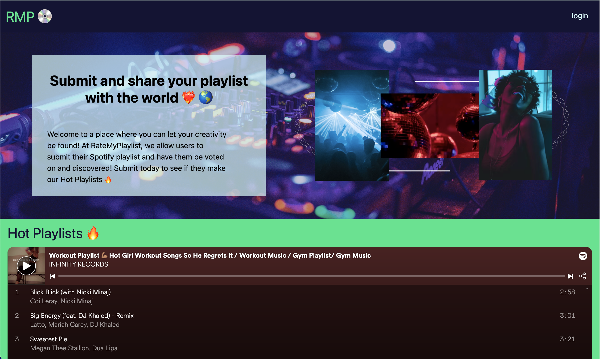

  # RateMyPlaylist
  
  
  

  ## Description
  The past two weeks, our team, Max Y., Deena S., and Jason W. have built our first full-stack web application. Our project is called RMP, pronounced Ramp and is short for RateMyPlaylist. Our site was inspired by one of our own's passion for making Spotify playlist. Users that are signed up can submit their Spotify playlist URLs and have them be embedded on our site to be voted on by the community. The more "favorites" a playlist has, the higher it appears on our homepage's Hot Playlists. The backend of this project not only holds User data, but Playlist and Favorite model data as well. It was built primaryly using Express.js, MySQL, Sequelize, JAWSDB, dotenv, and is written in JavaScript. The fronend of this project was build using Handlebars.js, TailwindCSS, Spotify's Embedded Player, and HTML. During the week and a half that our team was working, we made sure to collaborate and communicate effectively to accomplish our MVP goals. All parts of this project were worked on by different members and completion was a group effort.
  You can find a link to the deployed site [here.](https://protected-garden-77743.herokuapp.com/)

  ## Preview of Our Work ✨
  

  ## Table of Contents
  - [Installation](#installation)
  - [Usage](#usage)
  - [Credits](#credits)
  - [Tests](#tests)
  - [Questions](#questions)
  - [License](#license)

  ## Installation
  If you wish to install this app for your local machine, clone down this repo and run an 'npm init -y'. After that you'll need to enter the MySQL shell by running 'mysql -uroot -p', entering your password, and then run 'source db/schema.sql' and 'USE ramp_db;'. Exit the shell and run 'npm run seed' to seed the database. Finally, you can do 'npm start' to start the server and access the site using localhost.

  ## Usage
  Uploading and listening to Spotify playlists.

  ## Credits 🤍
  Spotify for their embedded player and to Jason W. and Max Y. for the idea that got us started 💙 💿

  ## Tests
  N/A

  ## Questions
  If you have any questions check out our GitHubs: [PixiePucker](https://github.com/PixiePucker), [DeenaSmith](https://github.com/DeenaSmith), and [JWhitney2209!](https://github.com/jwhitney2209)

  ## License
  
  This application is licensed by [MIT](https://opensource.org/licenses/MIT).